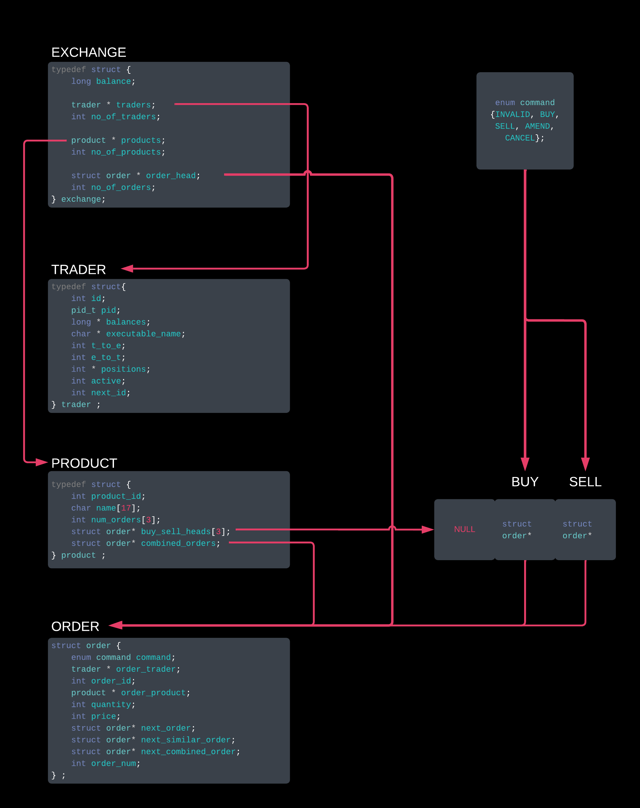

# Introduction
This assignment was completed for COMP2017 - Systems Programming. There were 2 main parts to the assignment, building a trader, and building an exchange. 

The general idea of the assignment was that the exchange program would track buy and sell orders from traders through FIFO pipes. Each trader was a child process of the exchange program. To read more about the structure, please refer to the [spec](/COMP2017_2023_A3_v1.0.pdf).

## Running the code
To run the code, use the follwoing commands
```
$ make clean
$ make
$ ./pe_exchange [product file] [trader 0] [trader 1] ... [trader n]
```

You can use the provided `products.txt`, and `./pe_trader`

# Code Description

## How the exchange works
My program is based around some structs that act as objects for the different components of the exchange, seen here...


The basic flow of my main file, `pe_exchange.c` is as follows

### Setup
- First, a check is done to ensure that enough comman arguments were given.
- Then, the signal halders are set up
  - the `SIGUSR1` handler, for detecting when there is a pipe to read form
  - the `SIGCHLD` handler, for detecting when a trader terminates.
- Then, the exchange struct is set up, this involves
  - reading in the product list, making a product struct for each of them, and then allocating and storing these structs in an array
  - creating a trader for each executable given. Similarly, these are created, then allocated and stored in an array.

### Forking traders
- Next, the connections with each of the traders are made. This involves doing the folling steps for each trader
  - creating 2 FIFOs (`pe_trader_i` and `pe_exchange_i`)
  - forking and executing the child's exectuable
  - In the parent side of the fork, this child's pid is saved to it's trader sturct, and the two pipes are opened pn the exchange side.
- Once the traders have been established ad connected to, the `MARKET OPEN;` message is sent to all traders.

### Main Loop - waiting for signals
- The main loop runs unitl all traders have been disconnected.
- If a `SIGCHLD` signla is recieved form a child, the global variable `volatile sig_atomic_t child_disconnected` is changed from it's default, `-1`, to the pid of the child that sent the signal.
- If a SIGUSR1 signal has been received from a child, then the global `volatile sig_atomic_t something_to_read` variable will be the pid of the trader that sent to the signal, instead of it's defualt state, `0`.
- With this in mind, the main loop first checks if `child_disconnected` has been changed from it's defualt. 
  - If it has, the corresponding trader struct gets the inactive flag, and the program checks if there are any traders still connected (if not, the loop breaks and the ending sequance begins)
- Next, we check if the `something_to_read` flag has changed from its defualt value. 
  - If it has, then we need to read something from a pipe and deal with it.
  - This involves figuring out the trader_id form the pid, and reading until a `;` is found form the appropriate pipe.
  - This message is then parsed into an order struct, and dealt with.
    - If the message was invalid, then the command for the order struct will be `INVALID`, and the invalid massage is sent to the trader.
    - Otherwise, the command receievs dictates what happens
      - a `BUY` or `SELL` command will be added to the linked lists
      - an `AMEND` command will cause the current order to be cancelled and replaces with a new one with the amended price and quatity
      - a `CANCEL` command will remove the corresponding order form the linked lists.
    - Then, a reponse message will be sent ot the involved trader, and a broadcast message will be sent to all other traders.
    - Next, the product from the incoming order is checked for any order matches, and they are executed as described in the assignment.
    - Finally, the exchange is reported, outputting all the current product and trader posititons
  - If, in the time that was spent processing an order or deactivating a trader, no signals have come in, then both flags will be in their default state. If this is the case, `pause` is claaed, and the program waits until another signal is received. 
    - If this is not the case, then one or more signals have been receievd, and the program immediately runs the next iteration of the loop to deal with these signals. 

### Ending Sequence
- Once all traders have disconnected, the programs 'packs down'
- For each trader, all pipes are closed.
- The total fees is printed, and then all allocated memory is freed.


## Design decisions for the trader and how it's fault tolerant

### Storing Orders
- When deisnging my program, I reliased that there were many different storage needs for orders to make retriveing them easier. THis was the storage system I settled on.
- Each order is it's own struct, that is allocated to the heap. This order node is then added to 3 linked lists.

- The exchange stores te head to a linked list of orders in the order that they were received. This list is navigated through with the `next_order` attribute.
- Each product has 3 linked lists. 
  - One that is all orders (BUY and SELL) in descending order of price (naviagted using the `next_combined_order` attribute)
  - Then, one for BUY orders and one for sell orders. The BUY orders are kept in descednign order of price, and the sell orders are kept in asecnding order of price. THis means that if the head of the BUY and SELL lists are not elligible to match, we know that there are no possible matches for the product. Equally, as we do match and remove orders, we will only ever be matching the heads of these lists. These lists (each order will only ever be in one of them) are navigated with the `next_similar_order` attribute.

#### Example
The exchange's linked list looks like this.
| COMMAND | TRADER ID | PRODUCT | PRICE | QUANTITY |
|---------|-----------|---------|-------|----------|
| BUY     | 0         | GPU     | 100   | 10       |
| SELL    | 0         | GPU     | 200   | 12       |
| BUY     | 1         | Router  | 300   | 42       |
| SELL    | 1         | Router  | 100   | 51       |
| SELL    | 1         | GPU     | 400   | 12       |
| BUY     | 0         | Router  | 250   | 34       |
| BUY     | 1         | Router  | 50    | 23       |
| BUY     | 3         | GPU     | 1000  | 50       |

The GPU combined list looks like
| COMMAND | TRADER ID | PRODUCT | PRICE | QUANTITY |
|---------|-----------|---------|-------|----------|
| BUY     | 3         | GPU     | 1000  | 50       |
| SELL    | 1         | GPU     | 400   | 12       |
| SELL    | 0         | GPU     | 200   | 12       |
| BUY     | 0         | GPU     | 100   | 10       |

The GPU SELL list looks like
| COMMAND | TRADER ID | PRODUCT | PRICE | QUANTITY |
|---------|-----------|---------|-------|----------|
| SELL    | 0         | GPU     | 200   | 12       |
| SELL    | 1         | GPU     | 400   | 12       |

The GPU BUY list looks like 
| COMMAND | TRADER ID | PRODUCT | PRICE | QUANTITY |
|---------|-----------|---------|-------|----------|
| BUY     | 3         | GPU     | 1000  | 50       |
| BUY     | 0         | GPU     | 100   | 10       |


### Fault Tolerance
- the first thing that is done is checking for enough command line arguments
- Any issues with the received message are found in parse, and result in the order being given a INVALID command.
- No message will be over 50 characters (based on the spec), so the reading function terminates at an ';', or at 50 characters, preventing an attempted write past the end of the buffer.
- Whenever a malloc is performed, it is checked that it was successful before proceeding.
- Both fork and exec are checked to be successful after thay are performed.